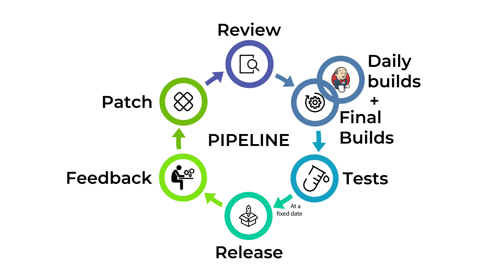

# Introduction

Dans le cadre du cours [[INFOM126] Automated Software Engineering](https://directory.unamur.be/teaching/courses/INFOM126/2023) donné par DEVROEY Xavier et assisté par MAQUOI Jérôme,
nous avons réalisé une "case study" sur [LibreOffice](https://www.libreoffice.org) afin de répertorier différentes métriques liées au DevOps.

Dans ce travail, nous commencerons par expliquer brièvement ce qu'est LibreOffice, le contexte dans lequel il a été créé et la liste des outils qu'il propose.

Ensuite, nous détaillerons notre analyse DevOps du logiciel, notamment en listant les différentes métriques DORA vues au cours et en analysant comment celles-ci sont mises en place. D'autres facteurs seront également passés en revue.

Enfin, nous proposerons notre avis concernant les améliorations qui pourraient être apportées à l'organisation du projet LibreOffice, avant de conclure.

# Description du cas d'étude

## Contexte et domaine d'application

L'histoire de la création de LibreOffice remonte à [2010](https://www.libreoffice.org/about-us/libreoffice-timeline/), lorsque des membres de la communauté de la suite OpenOffice décident de créer leur propre fondation [suite au rachat de Sun Microsystems par Oracle](https://opensource.com/article/23/2/libreoffice-history), devenant le nouveau propriétaire de la célèbre suite bureautique libre. Suite à cet évènement, le projet LibreOffice, fork d'OpenOffice, voit le jour.

Il a fallu attendre 2011 pour voir la [sortie de la première version stable de LibreOffice](https://blog.documentfoundation.org/blog/2011/01/25/the-document-foundation-launches-libreoffice-3-3/), avec un gain en popularité qui ne s'est pas fait attendre. À l'heure actuelle, il arrive que le nombre de téléchargements hebdomadaires [dépasse le million](https://blog.documentfoundation.org/blog/2021/12/14/record-number-of-libreoffice-downloads/).

Toutefois, le futur de LibreOffice pourrait sembler bouleversé suite à l’[annonce](https://lists.fedoraproject.org/archives/list/devel@lists.fedoraproject.org/thread/46ZZ6GZ2W3G4OJYX3BIWTAW75H37TVW6/) de RedHat de ne plus maintenir les paquets des différentes applications pour Fedora. En revanche, la suite sera toujours disponible sous forme de [Flatpak](https://flatpak.org/)).

Néanmoins, The Document Foundation continue de maintenir et d'améliorer les produits à l'heure actuelle comme le montre la très forte activité sur leur [blog](https://planet.documentfoundation.org/) et sur les différentes plateformes dont nous parlerons tout au long de ce travail.

## Description générale des fonctionnalités offertes

LibreOffice est une suite logicielle libre et open source.
Elle comporte plusieurs applications :

- Un éditeur de documents : [Writer](https://libreoffice.org/discover/writer)
- Un tableur : [Calc](https://libreoffice.org/discover/calc)
- Un créateur de présentations : [Impress](https://libreoffice.org/discover/impress)
- Un éditeur de documents graphiques (diagrammes et organigrammes) : [Draw](https://libreoffice.org/discover/draw)
- Un gestionnaire de base de données : [Base](https://libreoffice.org/discover/base)
- Un éditeur de formules et d'équations : [Math](https://libreoffice.org/discover/math)
- Un module de création de diagrammes : [Charts](https://libreoffice.org/discover/charts)

# Analyse DevOps du cas d'étude

## Identification des facteurs mis en place favorisant le DevOps

### Lead time

En ce qui concerne les moyens mis en place pour améliorer le temps entre la demande et la satisfaction de celle-ci, nous pouvons d'abord mentionner l'aspect open source. En effet, LibreOffice dispose de plusieurs [repositories Github](https://github.com/LibreOffice). Certains repositories contiennent des Github Actions, mais celles-ci semblent très peu utilisées.

Ces repositories Github sont des copies "read only" de leur code, car le projet LibreOffice dispose également de [son propre Git](https://git.libreoffice.org/core/). Les pull requests, qui seront expliquées dans un prochain point, se font uniquement via leur plateforme Gerrit.

Ceci permet donc à n'importe qui de jeter un œil sur le code pour éventuellement y contribuer en ajoutant des fonctionnalités, en améliorant le code existant ou en suggérant une modification.

Ensuite, The Document Foundation met à disposition [une plateforme Bugzilla](https://bugs.documentfoundation.org/) afin de signaler les bugs sur les différents outils inclus dans la suite LibreOffice. Cette plateforme permet aux contributeurs de pouvoir s'y retrouver dans les différents bugs et de les corriger plus rapidement lorsqu'ils ont été signalés. Leur plateforme Bugzilla comprend une documentation, expliquant comment l'utiliser.

Un site web est également mis en place afin de permettre aux utilisateurs de [poser des questions](https://ask.libreoffice.org) dans différentes langues, mais également de [soumettre des idées d'améliorations](https://ask.libreoffice.org/tag/feature-request) pour la suite logicielle.
Toutefois, un [guide](https://ask.libreoffice.org/t/this-is-the-guide-how-to-use-the-ask-site/10/3) expliquant comment utiliser ce site suggère d'utiliser directement Bugzilla pour soumettre les idées d'améliorations.

Ces plateformes et outils permettent ainsi d'accélérer le processus lorsqu'une demande de nouvelle fonctionnalité est soumise par un utilisateur.

### Deployment frequency

À propos du déploiement, The Document Foundation a opté pour la mise en place de [release plans](https://wiki.documentfoundation.org/ReleasePlan). En effet, la fondation essaye de publier une nouvelle version à date fixe (le vendredi). Toutefois, celle-ci se laisse une marge d'erreur de quelques jours au cas où seraient rencontrés des problèmes techniques, de build ou tout autre type de problème qui nécessiterait quelques modifications de dernière minute. Ce release plan impose, pour chaque version, les semaines de déploiement des fixes et améliorations ([schéma](https://wiki.documentfoundation.org/ReleasePlan#Version_scheme): alpha, beta, RC, ...).

Pour la release initiale d’une nouvelle version, une version alpha et ensuite une version beta sont déployées.

LibreOffice sort deux versions majeures par an en même temps que la sortie de Gnome et d’autres logiciels open source importants pour marquer deux grands évènements annuels.

LibreOffice sort également une bugfix release chaque mois après la sortie de la version majeure.

Il existe deux branches principales :

- Une branche Fresh: leur release la plus récente

- Une branche Still: la release précédente pour les utilisateurs plus sensibles comme les entreprises

Le déploiement à date fixe force les contributeurs à avoir une certaine discipline dans leur gestion de la modification du code, ce qui a pour effet de garder un bon rythme de déploiement malgré le côté open source qui implique parfois un manque de moyens.

Cependant cela demande une certaine automatisation du build process, ce qui est déjà prévu dans leur [plan d'accélération](https://wiki.documentfoundation.org/ReleasePlan#Accelerating_the_release_cycle).

### Mean time to restore (MTTR)

La documentation nous suggère deux plateformes pour signaler des problèmes dans LibreOffice:

- [Bugzilla](https://bugs.documentfoundation.org/): permet d’ouvrir un rapport de bugs, de classer ceux-ci à l'aide d'un nom/tag ou encore de trouver des bugs dupliqués

- [Redmine](https://redmine.documentfoundation.org/projects?jump=welcome): similaire à BugZilla mais pour les sites web et les services web liés à LibreOffice

L'utilisation de Bugzilla et de Redmine permet de réduire le temps entre la détection d'une erreur et son patch grâce à une centralisation de la plateforme de gestion des bugs qui permet une meilleure collaboration entre les contributeurs.

De plus, afin de mieux organiser les bugs, certains contributeurs ont pour rôle de [trier](https://wiki.documentfoundation.org/QA/BugTriage) ceux-ci. Le job de ces contributeurs consiste en la confirmation et la priorisation de signalement de bugs. Ainsi, les contributeurs pourront s'y retrouver et éventuellement décider de corriger plus rapidement les bugs les plus critiques.

Cependant, la suite LibreOffice ne proposant [pas directement de solution dans le cloud](https://www.libreoffice.org/download/libreoffice-online/), il n'est pas pertinent de détailler comment The Document Foundation gère les pannes de leurs services en ligne, ceux-ci n'étant pas directement liés au fonctionnement de LibreOffice.

### Change fail percentage

Afin de réduire le taux d'erreurs lors de changements dans le code, The Document Foundation met en place plusieurs pratiques assez classiques.

Tout d'abord, toute demande de modification de code passe par une étape de revue de code via [leur plateforme Gerrit](https://gerrit.libreoffice.org), à travers une pull request. Ainsi, tout code écrit par un contributeur sur sa branche sera revu avant d'être fusionné sur la branche principale. Pour revoir les changements des contributeurs, The Document Foundation propose une [liste d'experts](https://wiki.documentfoundation.org/FindTheExpert) dans divers domaines, qui peuvent être ajoutés comme reviewers à la pull request.

D'une part, ces pull requests permettent de rassembler plusieurs perspectives sur le code. Le reviewer pourrait trouver des défauts dans le code que le développeur n'aurait pas soupçonné. De plus, la relecture du code par une personne extérieure permet de s'assurer de sa lisibilité et de sa conformité aux normes établies (par exemple au niveau de différentes métriques ou des conventions). En résumé, ces revues de code permettent d'assurer un certain niveau de qualité de ce dernier, qui sera donc moins susceptible de provoquer des erreurs et plus facile à maintenir.

Ensuite, le projet LibreOffice sollicite également des contributeurs afin de réaliser [plusieurs sortes de tests](https://wiki.documentfoundation.org/QA), automatiques ou manuels. Parmi ces types de tests, nous pouvons notamment citer:

- [Les tests d'interface (UI tests)](https://wiki.documentfoundation.org/Development/UITests): permettent de tester le comportement des interfaces utilisateur
- [Les tests unitaires](https://wiki.documentfoundation.org/Development/Unit_Tests): permettent de tester une à une les fonctions des programmes.
- [Les tests de régression](https://wiki.documentfoundation.org/QA/Testing/Regression_Tests): permettent de s'assurer que les modifications apportées n'ont pas eu d'effet de bord sur les fonctionnalités déjà existantes.

La combinaison de ces différents types de tests, lorsqu'ils couvrent suffisamment de code, permet d'assurer son bon fonctionnement à différents niveaux, et qu'aucun effet de bord indésirable n'a été introduit. Il permet donc de montrer, dans une certaine mesure, que le code rédigé se comporte comme attendu.

## Enabling factors

### Lean management

Le projet LibreOffice évolue grâce à la collaboration de ses nombreux contributeurs. Le développement est mené par la communauté pour la communauté. Leur philosophie est décrite dans [leur manifeste](https://www.documentfoundation.org/media/tdf-manifesto.pdf).

Sur le site de LibreOffice, une page ["Community map"](https://www.libreoffice.org/community/community-map/) permet de voir où se situent certains contributeurs influents de LibreOffice, ayant été interviewés pour le [blog](https://blog.documentfoundation.org/), avec un moyen de les contacter.

En ce qui concerne la communication entre contributeurs, des mailing lists sont mises à disposition. Il est également possible de discuter avec les contributeurs via des [canaux de discussion IRC](https://wiki.documentfoundation.org/Website/IRC) qui sont reliés à [Matrix](https://matrix.to/#/!RDouOeSHcCrhQNlzLp:libera.chat) et à [Telegram](https://t.me/LibreOffice_QA)

Plus globalement, The Document Foundation est gérée par [différentes fonctions](https://fr.libreoffice.org/about-us/governance/):

- "Board of directors" ou BoD: les administrateurs principaux des projets et des différentes équipes de The Document Foundation.
- "Membership Committee" ou MC: gère les demandes d'adhésion et les renouvellements des membres et organiser les élections du BoD.
- "Board of trustees" (les membres): toute personne contribuant activement aux projets de la fondation, répondant à [certains critères](https://www.documentfoundation.org/media/statutes.pdf) et ayant rempli un [formulaire d'adhésion](https://membership.documentfoundation.org/).

D'autres entités aident le BoD, sans être des organes formels de la fondation:

- "Engineering steering Committee": composé des meilleurs développeurs de la communauté, cette entité offre une aide technique.
- "Advisory Board": forum pour les organisations pour fournir un soutien financier ou autre.

### Continuous delivery

Pour le continuous delivery, The Document Foundation utilise [Jenkins](https://jenkins.libreoffice.org) afin d'automatiser les builds, les tests et les déploiements des différentes applications.
Sur leur Jenkins, nous pouvons voir que des [builds journaliers](https://dev-builds.libreoffice.rg/daily/) sont lancés pour leurs applications.
Lancer des builds régulièrement permet de tester le code plus souvent et ainsi pouvoir identifier au plus tôt les différents problèmes présents.

Ils ont recourt à [TinderBox](https://ci.libreoffice.org/view/tb%20platform%20status) qui est leur outil d'aide à l'intégration continue. Ce dernier vérifie si le code de chaque projet compile sans erreurs et si la suite des tests est passée avec succès.
Un système de couleur permet de voir rapidement quels builds ont échoué ou réussi.
Sur le TinderBox de LibreOffice, lorsqu'un build échoue, on retrouve également le nom des personnes qui ont commit depuis le dernier build réussi.
Il s'agit d'un outil très visuel qui aide à déterminer quel projet nécessite une attention particulière afin de résoudre les différents bugs.

Un système de [nightly builds](https://www.libreoffice.org/download/pre-releases/) permet d'offrir une version de Libre Office qui est encore en développement. Les nightly builds sont utilisés uniquement à des fins de tests et The Document Foundation ne fournit aucune garantie sur ces versions.
Les développeurs ont également mis en place un système de **pre-release** afin de rendre disponible des versions "semblables" à la version finale, mais la déconseillent pour un usage en production.

### Westrums Organizational Culture

[The Document Foundation](https://www.documentfoundation.org/) est une entité auto-gouvernée sous le principe de méritocratie, c’est-à-dire que les gens sont récompensés sur base de leurs efforts, qui met le fun en avant.

LibreOffice a été fondé avec la conviction que la culture qui émerge d’une fondation indépendante stimule le meilleur chez ses contributeurs, ce qui amène aussi à produire un logiciel de meilleure qualité pour les utilisateurs.

Donc clairement LibreOffice est dans une culture générative avec une forte coopération de par son principe open source qui partage aussi les risques entre les collaborateurs.

### Identity

LibreOffice incarne les principes du logiciel libre. Basé sur [les quatre libertés fondamentales](https://fr.libreoffice.org/about-us/who-are-we/), le projet promeut la liberté d'exécution, de copie, de distribution, d'étude, de modification et d'amélioration du logiciel.

En favorisant l'accès gratuit aux outils de productivité bureautique, LibreOffice lutte contre la fracture numérique, encourage la préservation des langues maternelles, et s'oppose aux logiciels propriétaires.

Une attention particulière est apportée à la [diversité](https://wiki.documentfoundation.org/Diversity) des membres au sein de la fondation.

LibreOffice défend les droits des développeurs en utilisant des licences qui protègent l’open source comme la [license GNU](https://github.com/LibreOffice/core/blob/master/COPYING).

Il s'agit donc d'une communauté guidée par l'engagement envers la qualité, la fiabilité, la sécurité et la flexibilité des logiciels libres qui offre des opportunités de contribution variées conformément aux idées de The Document Foundation.

## Description du pipeline de développement

### Création d'un patch

Lorsqu'un développeur a terminé de développer sa fonctionnalité ou de corriger un bug, il va soumettre un **patch** afin que ce dernier passe par le processus de **review**.

### Review

Une tierce personne va revoir le code du patch et l'analyser constructivement. Le résultat de la review peut être :

- Le reviewer qui a vérifié et testé le patch n'a observé **aucun problème** et le patch est donc "merge" sur la branche principale
- Le reviewer a des **commentaires à faire** qui nécessitent l'attention du développeur
- Le patch a créé de **nouveaux problèmes sur d'autres fonctionnalités** et est marqué comme "Ne peut pas être merge"

Dans les deux derniers cas, le patch nécessite d'être modifié par le développeur.

### Builds

En plus des daily builds exécutés par Jenkins, des builds sont déclenchés automatiquement lorsqu'une modification a lieu sur le la branche principale du projet.

### Tests

The Document Foundation aimerait accélérer le cycle de versions. 
Pour ce faire, la fondation a déjà mis en place des daily builds afin d'accélérer le processus de test en continu des différentes mises à jour.

En analysant leur [fichier de configuration Jenkins](https://github.com/LibreOffice/lots/blob/ed115f571ba4ebb0a5ffce3535b53d8a918b8b56/Jenkinsfile#L33), on peut y voir une instruction qui configure l'exécution des tests.
On remarque d'ailleurs qu'ils utilisent [maven](https://maven.apache.org/) et [Junit](https://junit.org/junit5/) pour exécuter leur suite de tests.

Toujours dans ce même fichier, on peut également remarquer l'utilisation de [SonarQube](https://www.sonarsource.com/) et de [jacoco](https://www.jacoco.org/) pour analyser le code et récupérer des métriques sur la qualité du code et des tests

### Release

Le projet est build à date fixe selon un workflow idéal fournit par The Document Foundation :

- **Lundi** : date limite des commits.
- **Mardi** : un **tag** est créé à partir d'un commit qui build et qui passe les tests unitaires, tests subséquents et [smoke tests](https://github.com/LibreOffice/core/blob/32ce5fe4ed19a79b6f15a5d4d1892e6cc8d778d9/smoketest/README.md)
- **Mercredi** : les builds sont upload en version de [pré-release anticipée](https://dev-builds.libreoffice.org/pre-releases)
- **Jeudi** : les builds sont mis en ligne en miroir et une annonce est passée via les canaux de communications principaux
- **Vendredi** : les builds sont disponibles en pre-release officielle

### Feedback
Lorsque la release officielle est sortie publiquement, les utilisateurs commencent à rencontrer des problèmes et souhaitent de nouvelles fonctionnalités.
Le cycle de développement recommence et de nouveaux patchs sont recréés.

## Propositions d'améliorations

### Passer du système de releases à "semaine fixe" vers une release lorsque suffisamment de nouveautés sont apportées

Changer de méthode de release permettrait d'éviter de faire des releases précipitées mais également d'éviter la pression sur les développeurs qui se dépêchent de finir leurs modifications avant la date limite. Nous pensons qu'il serait plus intéressant de sortir une version mineure lorsque plusieurs bugs ont été corrigés et que les contributeurs se sont assurés que le code modifié est stable.

### Centralisation des repositories, des actions et des tickets

Comme expliqué précédemment, les repositories Github de LibreOffice sont uniquement des copies "read only" de leurs repositories sur leur plateforme Git. Il est également explicitement demandé de ne pas faire de pull requests directement sur Github mais sur leur instance Gerrit.

De plus, les signalements de bugs et les demandes d'ajout de fonctionnalités se font sur Bugzilla, Redmine ou autres plateformes. Toutes ces actions se retrouvent éparpillées et les versions des outils cités précédemment semblent relativement anciennes et peu agréables à utiliser.

Or, GitHub offre la possibilité de tout rassembler dans un repository (les issues pour les suggestions de fonctionnalités ou les signalements de bugs, les pull requests pour la revue de code, les actions pour automatiser certaines tâches, etc.). Ainsi, tout y serait rassemblé, bien intégré et cela éviterait les contributeurs de devoir naviguer entre plusieurs plateformes.

### Documentation pas à jour et désorganisée

Il arrive que plusieurs pages mentionnent les mêmes informations, mais que celles-ci ne correspondent pas. Selon nous, The Document Foundation devrait mettre à disposition une seule documentation, un peu comme leur Wiki actuel, fournissant les informations sur l'organisation entre contributeurs, les outils, les procédures à suivre pour contribuer, etc. Cette documentation devrait également être maintenue à jour.

# Conclusion

En conclusion, nous avons pu observer que LibreOffice met en place un certain nombre de pratiques **DevOps**.
Nous pouvons citer, par exemple, l'utilisation de la plateforme Bugzilla et d'un site web pour réduire le **lead time**.
L'équipe de LibreOffice a également mis en place un plan concret et adapté à l'open source pour accélérer leur **deployment frequency**.
Les plateformes Bugzilla et Redmine ont, par ailleurs, été utilisées pour réduire le **mean time to restore**.
Nous pouvons également citer la plateforme Gerrit qui aide au développement et à la review de code.
Et enfin, l'utilisation d'une suite de tests dans le but de réduire le **change fail percentage**.

Ensuite, nous avons exploré les différents facteurs favorisant le DevOps chez LibreOffice.
À propos du **lean management**, nous pouvons citer que le développement est mené par une communauté bien gérée et avec une certaine structure.
En ce qui concerne le **continuous delivery**, le projet LibreOffice a intégré Jenkins, TinderBox et un système de nightly builds dans leur processus.
Pour la **westrums organizational culture**, nous pouvons citer la communauté auto gouvernée qui met en avant des valeurs telles que le mérite, ainsi qu'une identité bien propre à l'open source basée sur des valeurs de liberté et de diversité qui représentent leur identité.

Après cela, nous avons analysé et résumé le pipeline de développement suivi par LibreOffice qui se déroule dans cet ordre :

1. Création d'un patch
2. Review
3. Build
4. Tests
5. Release
6. Feedback et fixes.

Enfin, nous avons émis une série de recommandations issues principalement du cours d'_Automated Software Engineering_ pour améliorer le processus de développement au sein du projet LibreOffice.
On y retrouve le changement du système de release à "semaine fixe" vers un système où une release est effectuée lorsqu'il y a un nombre conséquent de modifications stables qui ont eu lieu.
Ce changement évite les releases "vides" ou bâclées et diminue la pression sur les développeurs.
On conseille également de centraliser leurs repositories, actions et tickets qui, pour l'instant, sont dispersés sur plusieurs plateformes différentes.
La dispersion des ressources rend la tâche plus difficile aux développeurs et réduit l'attractivité pour les nouveaux contributeurs.
Ces différents changements permettraient un développement de meilleure qualité comme on le voit sur les projets qui centralisent la plupart des informations sur Github.
La documentation sera aussi de meilleure qualité, mieux maintenue à jour, avec moins de contradictions et mieux organisée, ce qui aidera tous les contributeurs.

En résumé, l'analyse approfondie de l'automatisation du développement de LibreOffice nous a permis de mieux comprendre l'importance de l'utilisation de bonnes pratiques dans le cadre du développement d'un logiciel et plus précisément dans le cadre d'un développement Open Source.
Les points faibles que nous avons remarqués peuvent servir de support à d'autres projets open source qui voudraient bénéficier de conseils généraux.

# Liens

- [Site web de LibreOffice](https://fr.libreoffice.org/)
- [Télécharger LibreOffice](https://fr.libreoffice.org/download/telecharger-libreoffice/)
- [Documentation](https://wiki.documentfoundation.org/Documentation)
- [Contribuer](https://fr.libreoffice.org/community/get-involved/)
